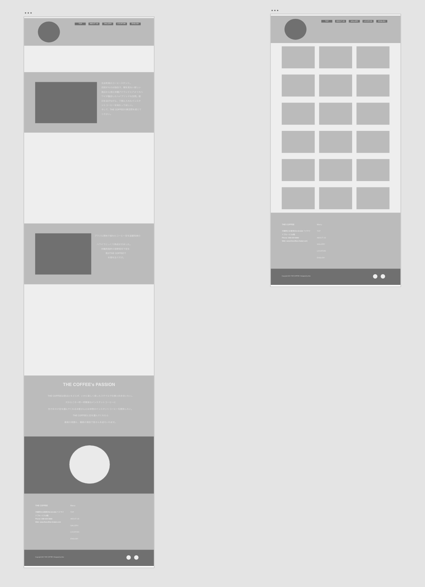
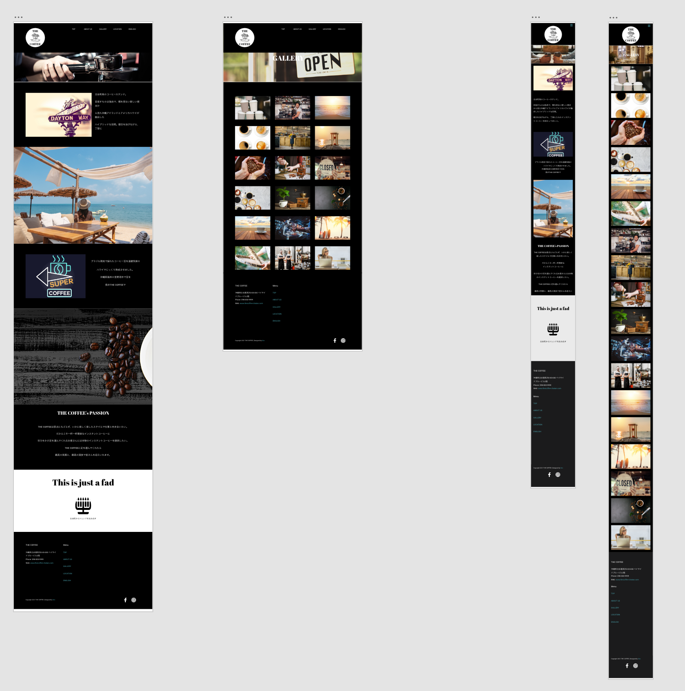

## 概要

---

練習用として架空のコーヒー cafeWeb サイトを制作する。

Web サイトの名称を「THE COFFEE」とする。

Adobe XD を使用してワイヤーフレームとデザインカンプを行い

HTML、SCCS、JavaScript（jQuery） でコーディングを行った、

Web 版とスマホ版（レスポンシブ）に対応

## 使用言語

---

- HTML
- SCSS
- JavaScript (jQuery)

## ワイヤーフレーム

---

## デザインカンプ

---

## 著者

---

[Ikko Tsuha]()

- Twitter: [@ikko1021](https://twitter.com/ikko1021)

- GitHub: [@Ikko-T](https://github.com/Ikko-T)

- Qiita: <a href="https://qiita.com/Ikko-T" rel="nofollow">@Ikko-T</a>

## コントリビューション

## ライセンス

---

(C)Copyright 2021 Ikko Tsuha

"THE COFFEE" is under [MIT license](https://en.wikipedia.org/wiki/MIT_License).
